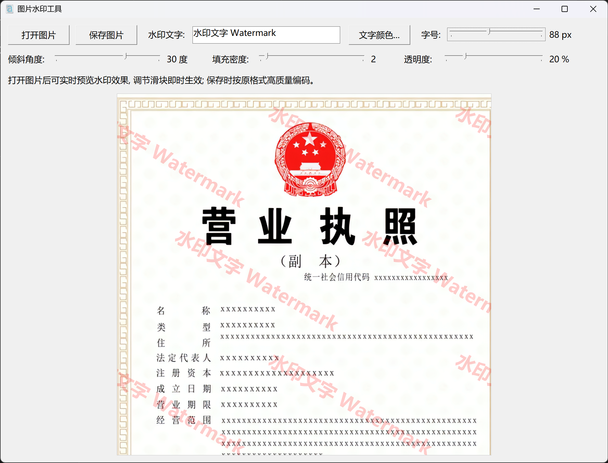

<div align="center">



# 图片水印工具 · Image Watermark Tool

**纯 C 语言 · Win32 API · 零第三方依赖 · 单文件可执行**

一个轻量、免安装、所见即所得的 Windows 图片水印工具 —— 全部实现只有一个 `watermark.c`。

[](LICENSE)
[](#)
[](#)
[](#)
[](#)

[**简体中文**](#chinese) · [**English**](#english)

</div>

---

<a id="chinese"></a>

## 🇨🇳 简体中文

### 简介

给图片加文字水印，本来是个很小众的需求，但现成的工具要么是笨重的在线网站（图片要上传到别人服务器），要么是收费软件，要么是 Python 脚本（要装一堆依赖）。

这个项目用 **纯 C + Win32 API** 写成，编译出来就是一个约 450 KB 的绿色 exe，双击即用，不写注册表、不装运行库。

核心特点：**加水印不改画质**。PNG / BMP / TIFF 输出**逐字节完全无损**，JPEG 以质量 100% 编码，全程不做任何缩放或重采样。

### ✨ 功能特性

| 功能 | 说明 |
| :--- | :--- |
| 🖼️ **常见格式** | 读取与写出 PNG / JPEG / BMP / TIFF / GIF |
| 👀 **实时预览** | 调节任何参数立即看到效果，无需反复保存对比 |
| ✍️ **文字内容** | 任意中英文，支持长文本 |
| 🎨 **文字颜色** | 系统标准取色器，随心取色 |
| 📏 **字号** | 10 – 200 px |
| 📐 **倾斜角度** | -90° – 90°，带抗锯齿旋转 |
| 🔁 **填充密度** | 1 – 20 列平铺，铺满整图 |
| 💧 **透明度** | 1% – 100% 精细可调 |
| 💎 **高质量输出** | 不重采样，不做二次压缩 |
| 🚀 **免安装** | 单文件绿色版，无第三方 DLL 依赖 |
| 🖥️ **高 DPI 感知** | 4K / 高缩放屏幕上文字清晰不发虚 |
| 🇨🇳 **中文界面** | 原生中文 UI，无需汉化 |

### 🚀 快速开始

#### 方式一：直接下载（推荐）

到 [**Releases**](../../releases) 页面下载 `watermark.exe`，双击运行即可。无需安装。

> 首次运行 Windows 可能提示「已保护你的电脑」，点击 **更多信息 → 仍要运行** 即可（因为 exe 没有代码签名）。

#### 方式二：自行编译

只需要一个 GCC，**不需要任何第三方库**。

**准备编译器**（任选其一）：

- [TDM-GCC](https://jmeubank.github.io/tdm-gcc/) —— 本项目开发所用，推荐 9.2 或更新
- [MinGW-w64](https://www.mingw-w64.org/) —— 官方发行版亦可

**编译**：直接双击 `build.bat`，或手动执行：

```bat
windres -i resource.rc -o resource.o

gcc -O2 -mwindows -municode -Wall -o watermark.exe watermark.c resource.o ^
    -lcomctl32 -lgdi32 -lgdiplus -lole32 -loleaut32 -luuid -lcomdlg32 -lshlwapi -lm
```

编译产物为 `watermark.exe`（约 450 KB）。

### 📖 使用方法

1. 点击 **打开图片**，选择要处理的图片
2. 在 **水印文字** 输入框中输入水印内容（默认 `水印文字`）
3. 按需调节 **文字颜色 / 字号 / 倾斜角度 / 填充密度 / 透明度**
   - 所有调整都会**实时预览**
4. 点击 **保存图片**，选择格式（PNG / JPEG / BMP / TIFF / GIF）与保存位置
5. 默认文件名是 `原文件名_水印.png`

**默认参数**：红色 · 50 px · 30° · 密度 3 · 透明度 20%

### 🔧 技术实现

| 环节 | 方案 |
| :--- | :--- |
| **解码** | Windows Imaging Component (WIC)，统一转换为 32bpp BGRA |
| **编码** | GDI+ 平面 API（`GdipCreateBitmapFromScan0` + `GdipSaveImageToStream`） |
| **文字遮罩** | GDI 在黑白 DIB 上渲染白字，提取为 8 位 alpha 通道 |
| **旋转** | 逆映射 + 双线性插值，避免锯齿 |
| **合成** | 按 alpha 权重混合到原图像素，原图像素不做任何重采样 |

**为什么解码用 WIC、编码却用 GDI+？**

WIC 的解码器在所有测试环境中都稳定可用，但它的**编码器**在部分 Windows 版本 / 编译工具链组合下，`IWICBitmapEncoder::Initialize` 会直接返回 `WINCODEC_ERR_UNSUPPORTEDOPERATION`，且无法通过更换流类型、缓存策略或供应商 GUID 绕过（已系统性排查）。因此编码环节改用 GDI+，它在所有测试环境下均工作正常，且同样支持全部 5 种格式与无损 PNG 输出。

> 附带一提：TDM-GCC 自带的 `wincodec.h` 中 `IWICBitmapEncoder` 的 vtable 顺序与真实 COM 接口不符，且 `TBM_*` 常量存在偏移。本项目对涉及的部分做了手工声明与规避。

### 📁 项目结构

```
image-watermark/
├── watermark.c     # 全部源代码（单文件，约 780 行）
├── resource.rc     # 图标资源脚本
├── watermark.ico   # 程序图标
├── watermark.png   # 界面截图 / README 配图
├── build.bat       # 一键编译脚本
├── LICENSE         # MIT 许可证
└── README.md
```

### ⚠️ 已知限制

- **仅支持 Windows**：全部基于 Win32 / COM / GDI+ API
- **JPEG 与 GIF 本身是有损格式**：
  - JPEG 即使质量 100% 仍会有轻微损失（色度抽样），这是格式特性
  - GIF 仅支持 256 色，颜色会有量化误差
  - 若需完全无损，请保存为 **PNG / BMP / TIFF**
- **带透明通道的图片**：保存为 JPEG / BMP / GIF 时透明区域会被丢弃（格式不支持 alpha）
- **水印内容不可编辑**：加水印是「烧录」到像素上的，保存后无法撤销，建议保留原图

### 📄 许可证

本项目采用 [**MIT License**](LICENSE) 完全开源 —— 可自由使用、修改、分发、商用，只需保留版权声明。

---

<a id="english"></a>

## 🇬🇧 English

### Introduction

Adding a text watermark to an image is a small need, but existing tools are either clunky online services (your images get uploaded to someone else's server), paid software, or Python scripts that drag in a pile of dependencies.

This project is written in **pure C with the Win32 API**. It compiles to a single ~450 KB portable executable — double-click and run. No registry writes, no runtime to install.

The key promise: **watermarking never degrades your image.** PNG / BMP / TIFF output is **byte-for-byte lossless**, JPEG is encoded at quality 100, and the original pixels are never resampled.

### ✨ Features

| Feature | Description |
| :--- | :--- |
| 🖼️ **Common formats** | Read & write PNG / JPEG / BMP / TIFF / GIF |
| 👀 **Live preview** | Every adjustment is previewed instantly |
| ✍️ **Text content** | Any text, including CJK |
| 🎨 **Text color** | Standard system color picker |
| 📏 **Font size** | 10 – 200 px |
| 📐 **Rotation** | -90° – 90°, anti-aliased |
| 🔁 **Tiling density** | 1 – 20 columns across the image |
| 💧 **Opacity** | Adjustable from 1% to 100% |
| 💎 **High-quality output** | No resampling, no extra re-compression |
| 🚀 **Portable** | Single executable, zero third-party DLLs |
| 🖥️ **High-DPI aware** | Crisp text on 4K / scaled displays |
| 🇨🇳 **Chinese UI** | Native Chinese interface |

### 🚀 Getting Started

#### Option 1: Download (recommended)

Grab `watermark.exe` from the [**Releases**](../../releases) page and run it. No installation required.

> Windows SmartScreen may warn on first launch (the binary is not code-signed). Click **More info → Run anyway**.

#### Option 2: Build from source

All you need is a GCC — **no third-party libraries**.

Compiler options:

- [TDM-GCC](https://jmeubank.github.io/tdm-gcc/) — used for development, 9.2+ recommended
- [MinGW-w64](https://www.mingw-w64.org/) — official distribution also works

Build by running `build.bat`, or manually:

```bat
windres -i resource.rc -o resource.o

gcc -O2 -mwindows -municode -Wall -o watermark.exe watermark.c resource.o ^
    -lcomctl32 -lgdi32 -lgdiplus -lole32 -loleaut32 -luuid -lcomdlg32 -lshlwapi -lm
```

The result is `watermark.exe` (~450 KB).

### 📖 Usage

1. Click **打开图片** (Open Image) and pick a file
2. Type your watermark text in the **水印文字** field (default: `水印文字`)
3. Tune **color / size / angle / density / opacity** as needed — the preview updates live
4. Click **保存图片** (Save Image), choose a format (PNG / JPEG / BMP / TIFF / GIF) and a location
5. The default filename is `originalname_水印.png`

**Defaults**: red · 50 px · 30° · density 3 · opacity 20%

### 🔧 Technical Notes

| Stage | Approach |
| :--- | :--- |
| **Decoding** | Windows Imaging Component (WIC), normalized to 32bpp BGRA |
| **Encoding** | GDI+ flat API (`GdipCreateBitmapFromScan0` + `GdipSaveImageToStream`) |
| **Text mask** | GDI renders white text on a black DIB, extracted as an 8-bit alpha channel |
| **Rotation** | Inverse mapping with bilinear interpolation to avoid aliasing |
| **Compositing** | Alpha-weighted blend onto the original pixels, which are never resampled |

**Why WIC for decoding but GDI+ for encoding?**

WIC's *decoders* work reliably everywhere, but its *encoders* return `WINCODEC_ERR_UNSUPPORTEDOPERATION` from `IWICBitmapEncoder::Initialize` on some Windows builds / toolchain combinations. This could not be worked around by changing the stream type, cache policy, or vendor GUID (thoroughly investigated). Encoding therefore uses GDI+, which works consistently and still supports all five formats with lossless PNG output.

> Side note: the `wincodec.h` shipped with TDM-GCC has an `IWICBitmapEncoder` vtable whose layout does not match the real COM interface, and its `TBM_*` constants are offset. This project declares the affected parts by hand.

### 📁 Project Structure

```
image-watermark/
├── watermark.c     # Entire source (single file, ~780 lines)
├── resource.rc     # Icon resource script
├── watermark.ico   # Application icon
├── watermark.png   # UI screenshot / README image
├── build.bat       # One-click build script
├── LICENSE         # MIT License
└── README.md
```

### ⚠️ Known Limitations

- **Windows only** — built entirely on Win32 / COM / GDI+ APIs
- **JPEG and GIF are inherently lossy formats**:
  - JPEG retains slight loss even at quality 100 (chroma subsampling) — a format property
  - GIF is limited to 256 colors, so colors are quantized
  - For truly lossless output, save as **PNG / BMP / TIFF**
- **Images with an alpha channel**: transparency is dropped when saving to JPEG / BMP / GIF (those formats have no alpha support)
- **Watermarks are destructive** — they are burned into the pixels and cannot be undone; keep your originals

### 📄 License

Released under the [**MIT License**](LICENSE) — free to use, modify, distribute, and use commercially, as long as the copyright notice is retained.
